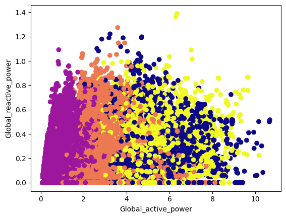
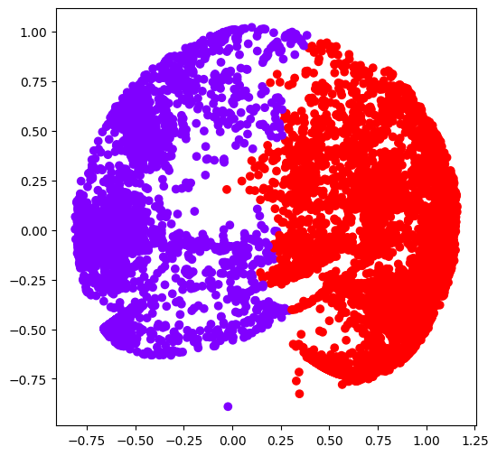

# Pembelajaran Mesin C

|         Nama         |    NRP     |
| :------------------: | :--------: |
| Alfan Lukeyan Rizki  | 5025211046 |
|  Daud Dhiya' Rozaan  | 5025211021 |
| Moch. Taslam Gustino | 5025211011 |
|    Ihsan Widagdo     | 5025211231 |

## K-Means Clustering

K-means clustering adalah metode clustering yang paling sederhana dan populer. Tujuan dari algoritma ini adalah untuk mengelompokkan data ke dalam beberapa kelompok berdasarkan atribut yang dimiliki oleh data tersebut. Algoritma ini bekerja dengan cara mengelompokkan data ke dalam kelompok-kelompok yang memiliki jarak terdekat dengan centroidnya.

## Agglomerative Clustering

Algoritma agglomerative adalah algoritma yang digunakan dalam metode klastering hierarkis. Ini bekerja dengan cara menggabungkan klaster yang memiliki kedekatan terdekat satu sama lain secara bertahap hingga hanya ada satu klaster yang tersisa.

## Tujuan Analisis : Segmentasi berdasarkan Konsumsi Energi

Mengelompokkan konsumen berdasarkan total konsumsi energi mereka. Misalnya, konsumen dengan konsumsi energi tinggi, sedang, dan rendah. Adapun metode clustering yang akan digunakan adalah algoritma k-means dan algoritma agglomerative.

## Hasil Analisis

Hasil analisis yang didapatkan adalah sebagai berikut:
| Algoritma | Jumlah Cluster Optimal | SSE | Silhouette Score |
| :---: | :---: | :---: | :---: |
| K-Means | 5 | 1734513.871965874 | 0.464963940512314 |
| Agglomerative | 2 | Undefined | 0.5793941106716007 |

Pada hasil analisis di atas, dapat dilihat bahwa jumlah cluster optimal yang didapatkan oleh algoritma k-means adalah 5. Hal tersebut di dapatkan dengan menggunakan metode evaluasi SSE lalu didapatkan elbow nya. Sedangkan pada algoritma agglomerative, jumlah cluster optimal yang didapatkan adalah 2. Hal tersebut di dapatkan dengan menggunakan metode evaluasi silhouette score, kemudian diambil nilai yang paling tinggi.

Selanjutnya pada perhitungan nilai evaluasi SSE, didapatkan nilai SSE sebesar 1734513.871965874 pada algoritma k-means. Sedangkan pada algoritma agglomerative, nilai SSE tidak dapat dihitung karena karena dalam algoritma agglomerative, klaster tidak memiliki pusat sebagaimana dalam k-means, sehingga SSE tidak dapat dihitung dengan cara yang sama.

Selanjutnya pada perhitungan nilai evaluasi silhouette score, didapatkan nilai silhouette score sebesar 0.464963940512314 pada algoritma k-means. Sedangkan pada algoritma agglomerative, didapatkan nilai silhouette score sebesar 0.5793941106716007. Dapat dilihat bahwa nilai silhouette score pada algoritma agglomerative lebih tinggi dibandingkan dengan algoritma k-means.

## Visualisasi Hasil Clustering

Berikut adalah visualisasi hasil clustering yang didapatkan dari kedua algoritma tersebut:

- K-Means Clustering

Pada visualisasi hasil clustering menggunakan algoritma k-means, terdapat 5 cluster yang dihasilkan. Setiap cluster ditandai dengan warna yang berbeda. Terdapat 4 warna yang digunakan, yaitu ungu, orange, kuning, dan biru. Terlihat pada visulasasi tersebut terdapat warna ke-5 yang tidak terlihat, hal tersebut dikarenakan nilai pada cluster tersebut bernilai NaN. Secara detail, berikut adalah nilai dari masing-masing cluster:

| Cluster | Global_active_power | Global_reactive_power |  Voltage   | Global_intensity | Sub_metering_1 | Sub_metering_2 | Sub_metering_3 |
| :-----: | :-----------------: | :-------------------: | :--------: | :--------------: | :------------: | :------------: | :------------: |
|    0    |      3.713422       |       0.189107        | 236.995969 |    15.829659     |    0.754372    |   34.943141    |   10.617939    |
|    1    |      0.508838       |       0.108896        | 240.782686 |     2.222871     |    0.044008    |    0.388365    |    0.231059    |
|    2    |      1.871159       |       0.123760        | 238.823716 |     7.842945     |    0.182817    |    0.473899    |   17.394534    |
|    3    |      4.055688       |       0.200470        | 236.213293 |    17.252143     |   36.730570    |    2.922936    |   10.981324    |
|    4    |         NaN         |          NaN          |    NaN     |       NaN        |      NaN       |      NaN       |      NaN       |

Hal ini menunjukkan bahwa clustering yang dilakukan oleh algoritma k-means tidak dapat mengelompokkan data dengan baik, sehingga terdapat cluster yang memiliki nilai NaN. Terdapat juga faktor lain dari dataset yang jumlah data yg cukup banyak hingga 1 juta data, sehingga mempengaruhi hasil clustering.

- Agglomerative Clustering

Pada visualisasi hasil clustering menggunakan algoritma agglomerative, terdapat 2 cluster yang dihasilkan. Setiap cluster ditandai dengan warna yang berbeda. Terdapat 2 warna yang digunakan, yaitu ungu dan merah. Secara detail, berikut adalah nilai dari masing-masing cluster:

| Cluster | Global_active_power | Global_reactive_power |
| :-----: | :-----------------: | :-------------------: |
|    0    |      -0.489085      |       -0.024088       |
|    1    |      0.802456       |       -0.061573       |

Data yang dihasilkan oleh algoritma agglomerative yang negatif disebabkan oleh proses normalisasi data yang dilakukan sebelum clustering. Hal ini tidak mempengaruhi hasil clustering yang didapatkan. Selain itu, Jumlah data yang digunakan dalam algoritma agglomerative lebih sedikit dibandingkan dengan algoritma k-means, yaitu sebanyak 10000 data berbanding 1 jt data.

## Kesimpulan

Pada masing masing algoritma clustering, k-means dan agglomerative, didapatkan hasil clustering yang berbeda. Pada algoritma k-means, didapatkan cluster yang optimal yaitu 5 cluster, sedangkan pada algoritma agglomerative, didapatkan cluster yang optimal adalah 2 cluster. Dari hasil evaluasi yang dilakukan, didapatkan bahwa algoritma agglomerative memiliki nilai silhouette score yang lebih tinggi dibandingkan dengan algoritma k-means. Hal ini menunjukkan bahwa algoritma agglomerative lebih baik dalam melakukan clustering pada dataset yang digunakan.

Pada algoritma k-means, konsumsi energi yang tertinggi berada pada cluster 3, sedangkan konsumsi energi yang terendah berada pada cluster 1, serta konsumsi energi yang sedang berada pada cluster 0 dan 2. Sedangkan pada algoritma agglomerative, konsumsi energi yang tertinggi berada pada cluster 1, sedangkan konsumsi energi yang terendah berada pada cluster 0. Hal ini menunjukkan bahwa hasil clustering yang didapatkan oleh kedua algoritma tersebut berbeda.
